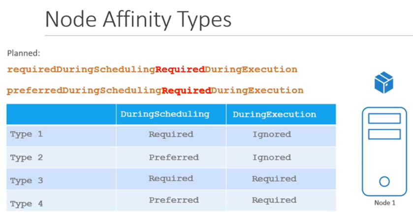

# 📌 CKA 스터디 - 1주차

## 🎯 교육명
**Prepare for the Certified Kubernetes Administrators Certification with live practice tests right in your browser - CKA**

🔹 **할인 코드**: `20KODE` (20% 할인 가능)  
🔹 **수강 링크**: [CKA 공식 사이트](https://training.linuxfoundation.org/certification/certified-kubernetes-administrator-cka/?cjdata=MXxOfDB8WXww&cjevent=26b1fe66ea7111ef80bb00230a18ba74&utm_source=CJ&utm_medium=affiliate)  
🔹 **비용**: 약 `$445`  
🔹 **GitHub 코스 저장소**: [바로가기](https://github.com/kodekloudhub/certified-kubernetes-administrator-course)

---

## 🗃️ Etcd
- **Key-Value Store 형식**의 데이터 저장소
- 실행 시 **`2379` 포트**에서 동작

---

## 🖥️ Kubernetes 주요 컴포넌트

### 🏛️ 마스터 노드 & 워커 노드 역할
✅ **마스터 노드**
- `etcd` → 쿠버네티스 상태 저장소
- `kube-controller-manager` → 컨트롤러 관리
- `kube-scheduler` → 파드 배치

✅ **워커 노드**
- `kubelet` → 노드에 수동 설치, 노드 등록
- `kube-proxy` → Pod 간 네트워크 통신

🔹 **CRI(Container Runtime Interface)**
- 다양한 컨테이너 런타임을 쿠버네티스에서 사용할 수 있도록 도와주는 인터페이스

---

## 📜 YAML 기본 구조
쿠버네티스 리소스 정의 시 4가지 주요 필드

```yaml  
apiVersion: # API 버전  
kind:       # 리소스 종류 (Deployment, Pod 등)  
metadata:   # 이름, 라벨 등 메타데이터  
spec:       # 상세 스펙  
```

---

## 🛠️ 실습 1 - Redis Pod 생성

```sh  
kubectl run redis --image=redis123 --dry-run=client -o yaml > redis.yaml  
kubectl apply -f redis.yaml  
```

✅ `--dry-run` 옵션을 사용하면 리소스 파일을 자동 생성 가능

---

## 🔁 ReplicaSet & ReplicationController
- `v1`에서는 **ReplicationController**를 사용하지만, **ReplicaSet을 권장**
- 리소스 단축어 지원:  
  ```sh  
  kubectl get po, no, deploy, rs, ds  
  ```
- `apply -f` vs `replace -f` 차이점 실습 필요
- `kubectl get all -A` → 모든 리소스 조회

---

## 🚀 Deployment
✅ **실무에서는 거의 항상 Deployment 사용** (ReplicaSet 직접 사용 X)

- 1️⃣ Deployment를 생성하면 **내부적으로 ReplicaSet이 자동 생성**됨.  
- 2️⃣ ReplicaSet은 **정해진 개수의 Pod를 실행 및 유지**.  
- 3️⃣ 새로운 버전(image 변경 등)으로 업데이트하면:
  - 새로운 **ReplicaSet이 생성**됨.
  - **Rolling Update 진행** (점진적 트래픽 이동).
  - 기존 **ReplicaSet의 Pod가 점진적으로 삭제**됨.  
- 4️⃣ 문제가 발생하면 **Deployment 롤백 가능**.

---

## 🔗 Service
✅ Pod 간 통신을 위한 네트워크 서비스 제공  
✅ 기본 포트 범위: `30,000` ~ `32,767`

---

## 🏛️ 명령형 vs 선언형

✅ **선언형이 실무에서는 더 선호됨** 😆
- YAML을 선언하고 `kubectl apply` 명령어로 적용하면 자동으로 관리됨.
- 유지보수와 재현성이 뛰어남.

✅ **시험에서는 명령형 사용 빈도가 높음**
- 빠르게 특정 리소스를 생성/수정할 때 사용.

---

## 🚀 스케줄러

- **이미 Node에 있는 Pod는 이동할 수 없음** → 이동하려면 **삭제 후 재배포**해야 함.
- 특정 노드에 배치하려면 `nodeName` 사용.

---

## ⚠️ Taint & Toleration

- **Toleration** → 특정 Taint가 설정된 노드에서도 실행 가능하게 함.
- Taint가 있는 노드에 Pod이 배치되는 것을 보장하지 않음.
- **마스터 노드는 기본적으로 Taint가 설정됨**.

### ✅ **Taint 설정 명령어**
```sh  
kubectl taint nodes {nodeName} {key}={value}:{effect}  
```  
➡️ `-`를 붙이면 해당 taint 제거 가능!

---

## 🔗 Node Affinity

✅ **기본적인 Node 배치 정책**

| 상태  | 필수 여부 | 실행 상태 |
|-------|----------|----------|
| `requiredDuringSchedulingIgnoredDuringExecution` | 필수(required) | 실행 중 변경 사항 무시 |
| `preferredDuringSchedulingIgnoredDuringExecution` | 선호(preferred) | 실행 중 변경 사항 무시 |
| `requiredDuringSchedulingRequiredDuringExecution` | 필수(required) | 실행 중에도 강제 적용 (계획됨) |
| `preferredDuringSchedulingRequiredDuringExecution` | 선호(preferred) | 실행 중에도 강제 적용 (계획됨) |

✅ **Affinity 적용 시 라벨이 변경되더라도 기존 배치는 유지됨.**



---