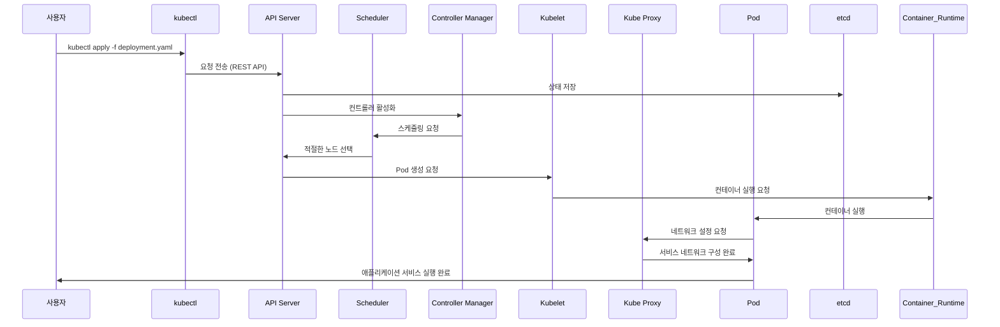

# 쿠버네티스(Kubernetes) 기본 개념 및 ECS 비교

## 1. 쿠버네티스란?
쿠버네티스(Kubernetes, K8s)는 컨테이너화된 애플리케이션의 배포, 확장 및 운영을 자동화하는 오픈소스 플랫폼입니다. 도커(Docker)와 비교하면, 도커가 개별 컨테이너의 실행 및 관리를 제공하는 반면, 쿠버네티스는 수많은 컨테이너를 클러스터 수준에서 조정하는 **"컨테이너 오케스트레이션 도구"**입니다.

### ECS와의 차이점
| 특징               | ECS (Elastic Container Service) | Kubernetes (쿠버네티스) |
|------------------|-----------------------------|--------------------|
| **관리 방식**      | AWS 관리형 서비스             | 자체 관리 가능 (EKS 지원) |
| **배포 단위**      | Task (컨테이너 그룹)           | Pod (컨테이너 그룹)   |
| **서비스 디스커버리** | AWS Cloud Map               | CoreDNS              |
| **로드 밸런싱**    | ALB, NLB                     | Ingress Controller   |
| **확장성**         | AWS Auto Scaling             | HPA(VPA 가능)         |

---

## 2. 쿠버네티스 주요 개념 (도커와 비교)

### 2.1. Pod (도커 컨테이너와 비교)
- **Pod란?**
    - 하나 이상의 컨테이너를 그룹화한 가장 작은 배포 단위.
    - 동일한 네트워크 네임스페이스(IP 공유)를 사용하여 컨테이너 간 통신이 용이.

**도커와 비교:**
- 도커에서는 개별 컨테이너를 실행하지만, 쿠버네티스에서는 여러 개의 컨테이너를 하나의 Pod로 묶어 동작함.
- 도커의 `docker run` 명령이 Pod의 `kubectl apply`에 해당.

**예제:**
```yaml
apiVersion: v1
kind: Pod
metadata:
  name: my-pod
spec:
  containers:
  - name: my-container
    image: nginx
```

---

### 2.2. Deployment (도커 Compose와 비교)
- **Deployment란?**
    - 애플리케이션 배포 및 관리를 담당.
    - 롤링 업데이트 및 롤백 제공.

**도커와 비교:**
- 도커에서는 `docker-compose up`을 통해 여러 컨테이너를 정의하고 배포했다면, 쿠버네티스에서는 Deployment를 사용해 여러 Pod의 배포 및 스케일링을 관리.

**예제:**
```yaml
apiVersion: apps/v1
kind: Deployment
metadata:
  name: my-deployment
spec:
  replicas: 3
  selector:
    matchLabels:
      app: my-app
  template:
    metadata:
      labels:
        app: my-app
    spec:
      containers:
      - name: my-container
        image: nginx
```

---

### 2.3. Service (도커 네트워크와 비교)
- **Service란?**
    - Pod 간 통신 및 외부 트래픽을 라우팅하기 위한 네트워크 엔드포인트 제공.

**도커와 비교:**
- 도커에서는 `docker network`를 사용해 컨테이너 간 통신을 설정했다면, 쿠버네티스에서는 Service를 이용하여 Pod 간 네트워크를 구성.

**예제:**
```yaml
apiVersion: v1
kind: Service
metadata:
  name: my-service
spec:
  selector:
    app: my-app
  ports:
  - protocol: TCP
    port: 80
    targetPort: 80
  type: ClusterIP
```

---

### 2.4. Ingress (도커 포트 바인딩과 비교)
- **Ingress란?**
    - 클러스터 외부에서 내부 서비스로의 HTTP/HTTPS 트래픽을 라우팅.

**도커와 비교:**
- 도커에서는 `docker run -p 8080:80` 명령으로 외부에서 내부로의 트래픽을 전달했지만, 쿠버네티스에서는 Ingress를 통해 여러 서비스에 대해 경로 기반 라우팅을 적용할 수 있음.

**예제:**
```yaml
apiVersion: networking.k8s.io/v1
kind: Ingress
metadata:
  name: my-ingress
spec:
  rules:
  - host: myapp.example.com
    http:
      paths:
      - path: /
        pathType: Prefix
        backend:
          service:
            name: my-service
            port:
              number: 80
```

---

## 3. ECS에서 쿠버네티스로 전환할 때 고려할 점
1. **운영 환경 변화**: AWS 관리형 ECS에 익숙하다면, 쿠버네티스의 셀프 매니징 환경 학습 필요.
2. **네트워크 구성 차이**: AWS의 VPC 통합과 비교해 쿠버네티스의 네트워크 설정이 더 복잡.
3. **모니터링 및 로깅**: CloudWatch 대신 Prometheus, Grafana 등의 추가 설정 필요.
4. **CI/CD 프로세스 변경**: ECS의 CodePipeline과 비교해 ArgoCD, Helm 등을 도입해야 함.

---

## 4. 쿠버네티스 도입 시 장점
- 멀티 클라우드 및 하이브리드 환경 지원.
- 오픈소스 생태계 활용 (Helm, Istio, ArgoCD 등).
- 확장성과 유연성 (자동 스케일링, 클러스터링).

---

## 5. 쿠버네티스 학습 로드맵
1. **기본 개념 이해**
    - Pod, Deployment, Service, Ingress
2. **명령어 학습**
    - `kubectl` 명령어 사용법
3. **쿠버네티스 설치 및 환경 설정**
    - 로컬 환경: Minikube, Kind
    - 클라우드 환경: AWS EKS
4. **배포 및 운영 관리 실습**
    - CI/CD 파이프라인 구성
    - 모니터링 및 로깅 설정

---

이 내용을 바탕으로 쿠버네티스를 단계적으로 도입하고 실무에 적용해보자!


